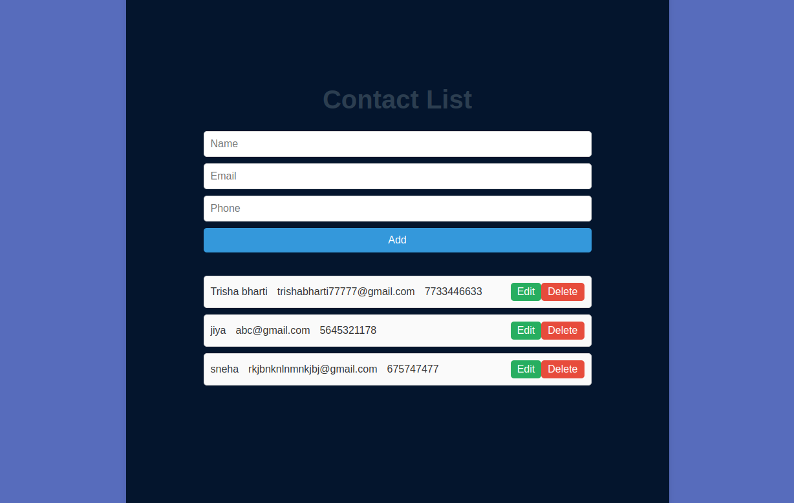

This is basically a full stack contact-list web application where user can create new contacts , edit saved contacts , delete saved contacts .
steps to run this project 
(A) change the database connection string in server.js file of backend folder 
(B) Run the frontend folder (npm run dev)
(C) Run the backend folder (node server.js)

